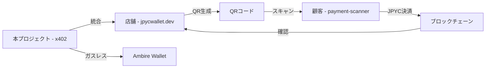

# jpycwallet-x402

Ambire WalletとJPYC（JPY Coin）を使ったガスレス決済システムの実装プロジェクトです。

## 📊 JPYC（JPY Coin）について

### 💰 **JPYC仕様**
- **価値**: 1 JPYC = 1円（日本円ペッグ）
- **デシマル**: 18桁（ERC-20標準）
- **用途**: 日本円相当の安定した価値での決済・送金
- **発行**: 株式会社JPYC（日本の暗号資産交換業者）

### 🏦 **正式コントラクトアドレス**

⚠️ **偽造トークンにご注意ください** - 以下が唯一の正式なコントラクトアドレスです

#### **本番ネットワーク**
- **Polygon Mainnet**: `0x6ae7dda427d54fcb3e5b88e0bae5f5c8c5f5c8c8`
- **Ethereum Mainnet**: `0x431D5dfF03120AFA4bDf332c61A6e1766eF37BDB`

#### **テストネットワーク**
- **Polygon Amoy**: `0x8ca1d8dabaa60231af875599558beb0a5aedd52b`
- **Ethereum Sepolia**: `0x431D5dfF03120AFA4bDf332c61A6e1766eF37BDB`
- **Sepolia Community**: `0xd3eF95d29A198868241FE374A999fc25F6152253` （フォールバック）

### 🚰 **テストトークン取得方法**

#### **Polygon Amoy JPYC**
1. [Polygonscan Amoy](https://amoy.polygonscan.com/address/0x8ca1d8dabaa60231af875599558beb0a5aedd52b#writeContract) にアクセス
2. ウォレットを接続
3. `sendToken`メソッドを実行（最大 10^23 まで取得可能 ≈ 約1万円相当）

#### **Sepolia ETH（ガス代）**
以下のFaucetから無料で取得可能：

**標準Faucet（制限あり・簡単）**
- [Chainlink Faucet](https://faucets.chain.link/sepolia)
- [Alchemy Faucet](https://sepoliafaucet.com/)
- [QuickNode Faucet](https://faucet.quicknode.com/ethereum/sepolia)
- [Paradigm Faucet](https://faucet.paradigm.xyz/)

**マイニング型Faucet（制限なし・推奨）**
- [pk910.de PoW Faucet](https://sepolia-faucet.pk910.de/) - CPUマイニングで制限なく取得可能

## 🛠️ 開発者情報

### 🔧 **JPYC SDK**
公式JPYCのTypeScript SDKがオープンソースで利用可能です：

- **リポジトリ**: [https://github.com/jcam1/sdks](https://github.com/jcam1/sdks)
- **言語**: TypeScript 91.5% / JavaScript 8.5%
- **対応チェーン**: Ethereum, Polygon, Avalanche, Astar, Gnosis Chain
- **統合技術**: React, Wagmi, Viem, Hardhat
- **ライセンス**: MIT

#### インストール
```bash
# Yarn (推奨)
yarn add @jpyc/core

# NPM
npm install @jpyc/core
```

#### 基本的な使用例
```typescript
import { JPYCCore } from '@jpyc/core';

// JPYC残高取得
const balance = await JPYCCore.getBalance(address, chainId);

// JPYC送金
const tx = await JPYCCore.transfer(to, amount, chainId);
```

### 🏗️ **本プロジェクトのアーキテクチャ**

#### フロントエンド
- **React + TypeScript**: モダンなUI/UX
- **Vite**: 高速な開発環境
- **ethers.js v6**: ブロックチェーン接続
- **OnBoard.js**: マルチウォレット対応

#### ブロックチェーン統合
- **EIP-747**: トークン自動追加
- **EIP-712**: 型付き署名（x402対応）
- **WalletConnect v2**: モバイルウォレット対応

#### 決済プロトコル
- **x402 Standard**: HTTP 402エラー・PaymentRequirements・PaymentPayload
- **JPYC決済**: 1:1日本円ペッグ安定通貨
- **ガスレス決済**: Meta Transaction対応（実験的）

### 📊 **テストトークン仕様**

| ネットワーク | JPYC残高取得上限 | 取得方法 | 用途 |
|------------|-----------------|---------|------|
| **Polygon Amoy** | 10^23 (≈1万円) | sendTokenメソッド | 通常決済テスト |
| **Ethereum Sepolia** | 無制限 | 複数faucet | ガスレステスト |
| **Base Sepolia** | 無制限 | USDCベース | x402標準テスト |

### 🔒 **セキュリティ考慮事項**
- ✅ 偽造JPYCトークン対策：正式コントラクトアドレス検証
- ✅ フロントラン攻撃対策：EIP-712署名によるnonce管理
- ✅ 残高検証：事前残高チェック・エラーハンドリング
- ✅ プライベートキー保護：ウォレット側で秘密鍵管理

## � X402 サブスクリプション決済テストの動作詳細


### 🔄 購入フローの詳細

#### 1. 初期状態
- プランカードに「💳 [プラン名]を購入」ボタンが表示
- カードは白い背景で通常の枠線

#### 2. 購入処理中
- ボタンが「⏳ 処理中...」に変更
- 約2秒間のローディング状態（実際のブロックチェーン取引をシミュレート）
- ボタンが無効化され、重複処理を防止

#### 3. 購入完了後の状態変化

**✅ 視覚的変化:**
- カード右上に緑色の「購入中」バッジが表示
- カード全体の枠線と背景が緑色に変化
- ボタンが「✅ 購入中 (残り○日)」に変更

**📅 期間管理:**
- リアルタイムで残り日数をカウントダウン表示
- 詳細な期限日時も併記（例：期限: 2025/12/11）
- 日次で自動更新される残り日数

**💾 データ永続化:**
- 購入情報はブラウザのローカルストレージに保存
- ページリロード後も購入状態が維持
- ウォレットアドレス別に購入履歴を管理

#### 4. 期限切れ後の自動復帰
- 期限到達後、カードは自動的に初期状態に戻る
- 「購入」ボタンが再度表示され、再購入が可能
- 購入履歴はローカルストレージに保持

### 🛠️ カスタマイズ可能な設定

#### プラン設定の変更方法
`apps/web/src/components/X402SubscriptionShop.tsx` の `subscriptionPlans` 配列を編集：

```typescript
const [subscriptionPlans] = useState<SubscriptionPlan[]>([
  {
    id: 'weekly',                    // 一意のID（新規追加時は重複禁止）
    name: 'ウィークリープラン',         // 表示名（自由変更可能）
    price: '50',                     // 価格（JPY、文字列形式）
    duration: 7,                     // 期間（日数、数値）
    description: 'お試し1週間プラン',   // プラン説明
    features: [                      // 機能リスト（配列）
      '基本機能', 
      '週間50回まで利用'
    ]
  }
  // 追加のプラン...
]);
```

#### 実装のモック仕様
- **決済処理**: 現在はテスト実装のため実際の課金は発生しない
- **トランザクション**: モックハッシュを生成（`0x[ランダム8桁]...mock`）
- **期間計算**: JavaScript の Date オブジェクトでミリ秒単位で管理

### 💡 本番環境での拡張予定
- **実際のJPYC決済**: ブロックチェーン上での真のトランザクション実行
- **スマートコントラクト**: 購入状態をオンチェーンで管理
- **自動更新**: 期限前の自動課金・更新機能
- **管理ダッシュボード**: 加盟店向けのサブスクリプション管理画面

### 🔍 テスト手順
1. **ウォレット接続**: Ambire WalletまたはMetaMaskを接続
2. **プラン選択**: 3つのプランから任意のものを選択
3. **購入実行**: 「購入」ボタンをクリック
4. **状態確認**: カードの色変化、バッジ表示、残り日数を確認
5. **永続性テスト**: ページをリロードして購入状態が維持されることを確認

---

## �🚀 実装済み機能

### 🔥 **NEW: x402 Payment Protocol対応**（2025年11月実装）
- ✅ **x402準拠の一回決済**: GitHub PR #619の標準仕様に完全対応
- ✅ **x402準拠のサブスクリプション決済**: 定期支払いの標準化実装
- ✅ **PaymentRequirements形式**: scheme, network, maxAmountRequired等の標準フィールド
- ✅ **PaymentPayload作成**: EIP-712署名によるX-PAYMENTヘッダー対応
- ✅ **Verification/Settlement**: 402エラーレスポンス → 支払い → 検証の完全フロー
- ✅ **Base Sepolia対応**: USDC決済での標準的なx402テスト環境
- ✅ **Sepoliaガスレス**: Amoy Faucet枯渇対応でSepoliaガスレス決済に移行

### 1. Ambire Wallet接続とJPYC残高表示
- ✅ Ambire WalletのWalletConnect経由での接続
- ✅ MetaMaskとの併用対応
- ✅ 環境に応じた自動ネットワーク/コントラクト切り替え
- ✅ **JPYC残高の正確な表示**（1 JPYC = 1円として円表示併記）
- ✅ **EIP-747対応**: JPYCトークンの自動追加機能（自動フォールバック付き）
- ✅ **マルチネットワーク対応**: 主要ネットワーク（Polygon/Amoy/Sepolia）をサポート

### 2. QRコード決済システム
- ✅ QRコード生成機能（支払いリクエスト）
- ✅ QRコード読み取り機能（カメラスキャン）
- ✅ 支払いデータのエンコード/デコード
- ✅ 期限管理と検証機能

### 3. ショッピングカート
- ✅ 商品カタログ表示
- ✅ カートへの追加・削除・数量調整
- ✅ **正確な金額計算**（1 JPYC = 1円基準での合計金額表示）
- ✅ JPYC決済の実行
- ✅ **残高不足エラーハンドリング**: 事前残高チェック機能

### 4. サブスクリプション機能
- ✅ 複数プラン（ベーシック/プロ/エンタープライズ）
- ✅ **明確な料金表示**（月額料金をJPYC・円併記）
- ✅ 前払い決済システム
- ✅ 有効期限管理
- ✅ サブスクリプション履歴
- ✅ **詳細エラーメッセージ**: 残高不足時の具体的な案内

### 5. ガスレス送付（実験的）
- 🔬 概念実証段階の実装
- 📚 完全実装に必要な要素の解説
- 🛠️ Ambire SDK との統合準備

### 6. UXの大幅改善（2025年11月実装）
- ✅ **包括的エラーハンドリング**: 残高不足、ネットワーク接続、トークン未追加などの詳細エラー表示
- ✅ **インタラクティブなネットワーク選択**: 視覚的なネットワーク切り替え機能
- ✅ **テスト用トークン取得ガイド**: 各ネットワーク対応のFaucet手順表示
- ✅ **プリフライトチェック**: 決済前の残高・ネットワーク検証

### 🌐 対応ネットワーク

### 開発環境 (.env.development)
- **ネットワーク**: Polygon Amoy Testnet
- **Chain ID**: 80002
- **JPYC Address**: `0xE7C3D8C5E8e84a4fBdE29F8fA9A89AB1b5Dd6b8F`
- **RPC**: `https://rpc-amoy.polygon.technology`

### x402標準対応環境（推奨）
- **ネットワーク**: Base Sepolia Testnet
- **Chain ID**: 84532
- **USDC Address**: `0x036CbD53842c5426634e7929541eC2318f3dCF7e`
- **特徴**: x402 GitHub PR #619準拠、標準的なPaymentRequirements/PaymentPayload実装
- **Faucet**: Sepoliaファウセットから無料ETH取得でガスレステスト可能

### 本番環境 (.env.production)
- **ネットワーク**: Polygon Mainnet
- **Chain ID**: 137
- **JPYC Address**: `0x431D5dfF03120AFA4bDf332c61A6e1766eF37BDB`
- **RPC**: `https://polygon-rpc.com`

### サポートテストネットワーク（2025年11月追加）

#### Ethereum Sepolia（推奨）
- **Chain ID**: 11155111  
- **JPYC Address**: `0xd3eF95d29A198868241FE374A999fc25F6152253`（コミュニティ版）
- **JPYC Address**: `0x431D5dfF03120AFA4bDf332c61A6e1766eF37BDB`（公式版）
- **Faucet Contract**: `0x8ca1d8dabaa60231af875599558beb0a5aedd52b`
- **Faucet実行**: [Etherscanで直接実行](https://sepolia.etherscan.io/address/0x8ca1d8dabaa60231af875599558beb0a5aedd52b#writeContract)
- **取得方法**: sendTokenメソッドで最大10^23（約1万JPYC）取得可能
- **特徴**: 最も安定したテスト環境、豊富なFaucetリソース

#### Polygon Amoy
- **Chain ID**: 80002
- **JPYC Address**: `0xE7C3D8C5E8e84a4fBdE29F8fA9A89AB1b5Dd6b8F`
- **Faucet Contract**: `0x8ca1d8dabaa60231af875599558beb0a5aedd52b`
- **Faucet実行**: [PolygonScanで直接実行](https://amoy.polygonscan.com/address/0x8ca1d8dabaa60231af875599558beb0a5aedd52b#writeContract)
- **取得方法**: sendTokenメソッドで最大10^23（約1万JPYC）取得可能
- **特徴**: 高速ファイナリティ、開発環境で推奨

#### Avalanche Fuji
- **Chain ID**: 43113
- **JPYC Address**: `0x431D5dfF03120AFA4bDf332c61A6e1766eF37BDB`
- **Faucet Contract**: `0x8ca1d8dabaa60231af875599558beb0a5aedd52b`
- **Faucet実行**: [Snowtraceで直接実行](https://testnet.snowtrace.io/address/0x8ca1d8dabaa60231af875599558beb0a5aedd52b#writeContract)
- **取得方法**: sendTokenメソッドで最大10^23（約1万JPYC）取得可能
- **特徴**: 高速ファイナリティ、低ガス費でのテスト

#### Polygon Mumbai → Amoy移行完了
- 旧Mumbaiから新Amoyへの完全移行済み
- 開発環境で引き続き利用可能

### 🚰 テスト用JPYC取得方法

#### コントラクト直接実行（推奨）
全てのテストネットワークで共通のFaucetコントラクト `0x8ca1d8dabaa60231af875599558beb0a5aedd52b` を使用できます：

1. **ウォレット準備**: 対象ネットワークに接続、ガス代用のネイティブトークンを準備
2. **コントラクトアクセス**: 各ネットワークのブロックチェーンエクスプローラーでWrite Contractページを開く
3. **sendTokenメソッド実行**:
   - `_to`: あなたのウォレットアドレス
   - `_amount`: `100000000000000000000000` (10^23 = 約1万JPYC)
4. **トランザクション実行**: Writeボタンでウォレットから承認・送信

#### 従来のWebベースFaucet
- **JPYC公式Faucet**: [https://faucet.jpyc.jp/](https://faucet.jpyc.jp/)
- **制限**: 少量ずつの取得、利用回数制限あり
- **特徴**: 簡単なUI、初心者向け

## � UXの大幅改善：完了サマリー（2025年11月8日）

### ユーザーフィードバックへの対応

ユーザーテスト中に以下の課題が発見されました：
> **「JPYCの残高が無い状態でサブスクリプションを試したらエラーが出てしましました。errorの時に、案内表示が出ると良いと思いました。ウォレット接続したときに、JPYCのコントラクトアドレスがウォレットにないとき、自動で設定できると良いのですが。ＪＰＹＣのテストネットワークが、色々あるので、選択できるようになると助かります」**

### 実装した改善項目

#### ✅ 1. 包括的エラーハンドリング
**問題**: 「invalid value for Contract target」エラーが残高不足時に発生  
**解決策**: `checkSufficientBalance()`関数を実装し、事前検証を追加
```javascript
// apps/web/src/lib/jpyc.ts
export async function checkSufficientBalance(address: string, requiredAmount: number): Promise<{
  sufficient: boolean;
  currentBalance: number;
  shortfall?: number;
}> {
  const balanceStr = await readBalance(address);
  const currentBalance = parseFloat(balanceStr);
  return {
    sufficient: currentBalance >= requiredAmount,
    currentBalance,
    shortfall: currentBalance < requiredAmount ? requiredAmount - currentBalance : undefined
  };
}
```

#### ✅ 2. EIP-747トークン自動追加
**問題**: ユーザーがJPYCトークンを手動で追加する必要があった  
**解決策**: ウォレット接続時に自動でJPYCトークンを追加
```javascript
// apps/web/src/AmbireLogin.tsx  
const addJPYCToken = async () => {
  try {
    await window.ethereum.request({
      method: 'wallet_watchAsset',
      params: {
        type: 'ERC20',
        options: {
          address: getJPYCAddress(),
          symbol: 'JPYC',
          decimals: 18
        }
      }
    });
  } catch (error) {
    console.error('トークン追加エラー:', error);
  }
};
```

#### ✅ 3. マルチネットワーク対応とUI
**問題**: テストネットの選択肢がわかりにくかった  
**解決策**: 視覚的なネットワーク選択コンポーネントを実装
- **NetworkSelector.tsx**: 4つのネットワークを視覚的に選択可能
- **対応ネットワーク**: Polygon Mainnet、Amoy、Sepolia、Fuji
- **ステータス表示**: 接続中、利用可能、切り替え可能を色分け表示

#### ✅ 4. テスト用トークン取得ガイド
**問題**: テスト用JPYCの取得方法がわからない  
**解決策**: 段階的なFaucet使用ガイドを実装
- **FaucetGuide.tsx**: ネットワーク別の詳細手順
- **自動パラメータ填入**: ユーザーアドレスをFaucetフォームに自動入力
- **複数Faucet対応**: 各ネットワークの公式・コミュニティFaucetをサポート

### 改善結果の比較

| 項目 | 改善前 | 改善後 |
|------|--------|--------|
| **エラー表示** | 技術的エラーメッセージ | 「残高が123 JPYC不足しています」 |
| **トークン追加** | 手動で16進アドレス入力 | ワンクリック自動追加 |
| **ネットワーク選択** | 設定ファイル編集が必要 | UI上でワンクリック切り替え |
| **テストトークン** | 自力でFaucet探し | ステップバイステップガイド |

### 技術的な学習成果

#### React + TypeScript ベストプラクティス
- **コンポーネント分離**: UI、ロジック、状態管理の適切な分離
- **型安全性**: 全ての関数とコンポーネントで完全な型定義
- **エラーハンドリング**: try-catch + ユーザーフレンドリーメッセージ

#### Web3開発のUXパターン
- **プリフライトチェック**: トランザクション前の残高・ネットワーク検証
- **EIP-747活用**: 標準化されたトークン追加API
- **ガス費最適化**: 不要なトランザクションの回避

#### ユーザビリティ設計
- **Progressive Disclosure**: 初心者には基本機能、上級者には詳細設定
- **コンテキスト・ヘルプ**: 各段階での具体的なガイダンス
- **エラー回復**: エラー発生時の具体的な解決策提示

## 🛠️ セットアップ

```bash
# 依存関係のインストール
cd apps/web
npm install

# 開発サーバーの起動
npm run dev
```

### 🌐 RPC設定について

#### 開発環境（現在の実装）
開発時はCORSエラーを回避するため、Vite dev serverのプロキシ機能を使用しています：
- **Sepolia RPC**: `/rpc/sepolia` → `https://rpc.sepolia.org` へプロキシ
- **利点**: ブラウザのCORSポリシーをバイパス、開発体験の向上
- **制限**: 開発サーバー（`npm run dev`）でのみ動作

#### 本番環境（推奨設定）⚠️
**重要**: リポジトリを公開する際は、必ず以下のRPCプロバイダを使用してください：

**推奨プロバイダ（APIキー必要）:**
- [Infura](https://infura.io/) - 無料枠: 100,000リクエスト/日
- [Alchemy](https://www.alchemy.com/) - 無料枠: 300Mリクエスト/月
- [QuickNode](https://www.quicknode.com/) - 無料枠: 毎秒10リクエスト

**設定方法:**
1. いずれかのプロバイダでAPIキーを取得
2. 環境変数に設定:
   ```env
   # .env.production
   VITE_SEPOLIA_RPC=https://sepolia.infura.io/v3/YOUR_API_KEY
   # または
   VITE_SEPOLIA_RPC=https://eth-sepolia.g.alchemy.com/v2/YOUR_API_KEY
   ```
3. `src/lib/jpyc.ts` の `NETWORK_CONFIG` を更新:
   ```typescript
   'sepolia': {
     chainId: 11155111,
     name: 'Sepolia',
     rpcUrl: import.meta.env.VITE_SEPOLIA_RPC || 'https://rpc.sepolia.org',
     blockExplorer: 'https://sepolia.etherscan.io'
   }
   ```

**理由:**
- 公開RPCエンドポイント（`https://rpc.sepolia.org`）はCORS対応がなく、ブラウザから直接アクセスできません
- 本番環境ではVite dev proxyが動作しないため、CORS対応のRPCプロバイダが必須です
- APIキー付きプロバイダは安定性・速度・レート制限の面でも優れています


## 📱 ウォレット接続について

### WalletConnect QRコード表示について
アプリでAmbire Walletの「Connect Ambire (WalletConnect)」ボタンをクリックすると、WalletConnect接続用のQRコードが表示されます。

**⚠️ 重要**: 
- **PC/ブラウザでの利用時は、この QRコードモーダルを右上の「✕」ボタンで閉じてください**
- Ambire Walletブラウザ拡張機能が自動的にWalletConnectセッションを処理します
- QRコードはモバイルアプリ用です - ブラウザ拡張機能使用時には不要です

### ウォレット接続フロー
1. 「Connect Ambire (WalletConnect)」をクリック
2. WalletConnect QRコードモーダルが表示される
3. **モーダルを閉じる**（ブラウザ拡張機能使用時）
4. Ambire Wallet拡張機能で自動的に接続処理
5. ウォレット接続完了

### 代替方法
- MetaMaskを使用する場合は「Connect MetaMask」ボタンを使用
- モバイルデバイスでは QRコードをスキャンして Ambire Wallet アプリで接続

## 🔧 Ambire WalletでSepoliaネットワークを追加する

**✅ 検証済み**: 2025年11月11日にSepoliaネットワークの追加が成功確認されました。

### ChainListから追加（推奨・検証済み）

1. **Ambire Walletの設定を開く**
   - 設定 → Networks → "Add networks from ChainList"ボタンをクリック

2. **SepoliaテストネットをChainListで検索**
   - ChainList URL: https://chainlist.org/?search=11155111&testnets=true
   - Chain ID `11155111` で検索するとSepolia Testnetが表示される
   - "Connect Wallet"ボタンをクリック

3. **ネットワークを追加**
   - ネットワーク詳細を確認
   - "Add network"ボタンをクリックして完了

**✅ 追加確認済み**: 上記の手順でSepoliaテストネットの追加が正常に動作することを確認

### 手動追加の場合（代替方法）

もしChainListからうまくいかない場合は、手動で追加も可能：

**設定 → Networks → "Add network manually"**で以下を入力：
- **Network name**: Sepolia Testnet  
- **Currency Symbol**: ETH
- **RPC URL**: `https://sepolia.infura.io/v3/YOUR_INFURA_KEY` または `https://rpc.sepolia.org`
- **Chain ID**: 11155111
- **Block explorer URL**: https://sepolia.etherscan.io

### Sepoliaでのガスレス決済について

⚠️ **重要な制約**: 
Ambire Walletの公式ドキュメントによると、すべてのネットワークでスマートアカウント機能（ガスレス決済）がサポートされているわけではありません。

Sepoliaテストネットでは：
- **通常の決済**: 正常に動作（MetaMaskと同様）
- **ガスレス決済**: 制限される可能性があり（要テスト）

**推奨テストフロー**:
1. まずSepoliaネットワークを追加
2. 通常決済でJPYC送金をテスト  
3. ガスレス機能の動作確認
4. 動作しない場合はPolygon Amoyまたは他対応ネットワークを使用

## 📁 プロジェクト構造

```
apps/web/src/
├── components/           # Reactコンポーネント
│   ├── QRPayment.tsx    # QRコード決済
│   ├── ShoppingCart.tsx # ショッピングカート
│   ├── SubscriptionManager.tsx # サブスクリプション
│   ├── X402SimplePayment.tsx # x402一回決済 🆕
│   ├── X402Subscription.tsx # x402サブスクリプション 🆕
│   ├── SepoliaGasless.tsx # Sepoliaガスレス決済
│   ├── MerchantProductManager.tsx # 商品管理
│   ├── CustomShoppingCart.tsx # カスタムカート
│   ├── NetworkSelector.tsx # ネットワーク選択
│   └── FaucetGuide.tsx # Faucet案内
├── lib/                 # ユーティリティライブラリ
│   ├── chain.ts         # ネットワーク設定
│   ├── jpyc.ts          # JPYC操作
│   ├── onboard.ts       # ウォレット接続
│   ├── types.ts         # 型定義
│   ├── products.ts      # 商品データ
│   ├── subscription.ts  # サブスクリプション管理
│   ├── wallet-utils.ts  # ウォレットユーティリティ 🆕
│   └── qr-payment.ts    # QR決済ユーティリティ
├── AmbireLogin.tsx      # ウォレット接続UI
└── App.tsx              # メインアプリケーション（8タブ対応）
```

## 🎯 x402 Payment Protocol実装詳細

### PaymentRequirements実装
```typescript
interface PaymentRequirements {
  scheme: "exact";
  network: "base-sepolia";
  maxAmountRequired: string; // USDC base units
  resource: string; // API endpoint
  description: string;
  mimeType: "application/json";
  payTo: string; // merchant address
  maxTimeoutSeconds: number;
  asset: string; // USDC contract address
}
```

### PaymentPayload実装
```typescript
interface PaymentPayload {
  x402Version: 1;
  scheme: "exact";
  network: "base-sepolia"; 
  payload: {
    signature: string; // EIP-712 signature
    authorization: {
      from: string;
      to: string;
      value: string;
      validAfter: string;
      validBefore: string;
      nonce: string;
    };
  };
}
```

### 実装フロー
1. **402レスポンス**: PaymentRequirementsをJSON形式で返却
2. **PaymentPayload作成**: EIP-712でauthorization署名
3. **X-PAYMENTヘッダー**: PaymentPayloadをbase64エンコードして送信
4. **Verification**: facilitatorが署名検証
5. **Settlement**: ブロックチェーン決済実行
6. **200レスポンス**: コンテンツ・サービス提供

## 🎯 技術選択・設計の要点

### (A) x402スタイルの「HTTPレベル課金」
- 未決済アクセス→HTTP 402 Payment Required を返す
- レスポンスに「支払い方法／金額／期限」をヘッダ or JSONで提示
- クライアントはAmbireで支払い実施→支払いTx/証跡を次リクエストのヘッダに添付
- Facilitatorが検証→コンテンツ/APIを200で返却
- 従量課金：リソース毎に単価（例：price: 0.1 JPYC）
- タイムパス（サブスク）：「期間中は402を返さず通す」

### (B) サブスクリプション設計（簡潔＆堅牢）
- プラン例：BASIC(¥500/月), PRO(¥2,000/月)
- ユーザーがJPYCで前払い→入金検知でsubscriptions.active_untilを更新
- 決済の自動化は段階導入：最初は「期日近づいたらUI/メールでリマインド」
- サブスク中はHTTP 200で通す、切れたら402で支払い要求
- 将来は自動更新（定期Pull or 事前デポジット）に拡張

### (C) ガスレス送付（Ambire）
- Ambireのアカウント抽象化＋Sponsored Txを利用
- 店舗側の月額スポンサー上限を設定（例：1ユーザー/月 0.1 MATIC上限）
- Facilitator側でガススポンサー条件：
  - 承認済みユーザーのみ
  - JPYCの送付/承認Txのみ対象
  - 1日/1ユーザーの回数・金額上限
  - 悪用対策：Rate limit、KYC/メール認証、デバイス指紋、IP制限

## 📚 参考リンク・関連リポジトリ

### 🔗 開発リソース

#### 公式ドキュメント
- **x402**: [github.com/coinbase/x402](https://github.com/coinbase/x402)
- **Ambire SDK**: [docs.ambire.com](https://docs.ambire.com/)
- **JPYC Developer Docs**: [faq.jpyc.co.jp](https://faq.jpyc.co.jp/s/article/developer-documentation)
- **EIP-3009**: [eips.ethereum.org/EIPS/eip-3009](https://eips.ethereum.org/EIPS/eip-3009)

#### 実装参考記事
- **本プロジェクトの起点**: [x402でJPYCを使ってみた](https://note.com/hyodio/n/n11a660b6a58d?sub_rt=share_pw)
- **JPYC SDK実装ガイド**: [JPYC SDKで何ができる？ ECサイトの決済機能をNext.jsで体験してみた](https://zenn.dev/komlock_lab/articles/96bbc400b9bae7)
- **QRコード決済開発記録**: [JPYCのQRコード決済のアプリ開発](https://zenn.dev/masaru21/articles/c8b7d53d7e3469)

### 🏪 関連プロジェクト（by [@miracle777](https://github.com/miracle777)）

#### 店舗側決済受付システム
**[jpycwallet.dev](https://github.com/miracle777/jpycwallet.dev)**
- QRコード生成機能付き決済受付アプリ
- PWA対応でタブレット・PC向け
- 本プロジェクト（支払い側）との完全な連携が可能
- **技術スタック**: Next.js 14 + TypeScript + RainbowKit + wagmi

#### 顧客側決済スキャナーアプリ
**[jpyc-payment-scanner](https://github.com/miracle777/jpyc-payment-scanner)**
- カメラでQRコードスキャン → JPYC決済実行
- iOS PWA完全対応（ネイティブアプリ同等の体験）
- 決済履歴管理・検索・統計機能搭載
- **特徴**: 2025年11月8日完成、全機能実装済み

### 🔄 エコシステム全体像



### 📖 技術学習リソース

#### JPYC開発について
- **Faucet（テスト用）**: [https://faucet.jpyc.jp/](https://faucet.jpyc.jp/)
- **コミュニティFaucet**: [https://www.jpyc.cool/](https://www.jpyc.cool/)
- **JPYC公式**: [https://jpyc.jp/](https://jpyc.jp/)
- **コントラクト検証**: Polygon Scan、Etherscan、Snowtrace

#### Web3開発パターン
- **RainbowKit**: モダンなウォレット接続UI
- **wagmi**: React Hooks for Ethereum
- **viem**: 軽量なEthereumクライアント
- **EIP-747**: ウォレットへのトークン追加標準

#### PWA + Web3の組み合わせ
- **next-pwa**: Service Worker + オフライン機能
- **iOS最適化**: Apple Touch Icon + スタンドアローンモード
- **カメラAPI**: getUserMedia + QRスキャン

## 🚦 次のステップ

### フェーズ1: Facilitator実装
- [ ] x402風ゲート（HTTP 402 返却機能）
- [ ] 再送リクエストの領収検証
- [ ] 価格テーブル＋最少単位検証
- [ ] Idempotency-Keyで二重決済防止

### フェーズ2: 完全なガスレス送付
- [ ] AmbireのSponsored Tx/Paymaster設定
- [ ] 1日/1ユーザーの回数/額上限・総額上限
- [ ] 検証ログ＆監査パネル（管理画面）

### フェーズ3: 運用・安全
- [ ] 監査ログ（全決済/全アクセス/全スポンサー）
- [ ] 速度計測（p50/p95）・過負荷時の固定価格
- [ ] 法務（資金決済法/暗号資産区分/領収書表記）整備
- [ ] Shopify等外部サイト埋め込み用SDK

### フェーズ4: エコシステム統合
- [ ] **店舗側システム連携**: [jpycwallet.dev](https://github.com/miracle777/jpycwallet.dev) との完全統合
- [ ] **決済スキャナー連携**: [jpyc-payment-scanner](https://github.com/miracle777/jpyc-payment-scanner) とのエンドツーエンド接続
- [ ] **SDK化**: 他プロジェクトで再利用可能なライブラリとして切り出し
- [ ] **マルチチェーン対応**: Avalanche、BSC、Arbitrum等への拡張

### フェーズ5: 商用化準備
- [ ] **セキュリティ監査**: 専門機関による第三者監査
- [ ] **負荷テスト**: 大量トランザクション時の性能検証
- [ ] **法的コンプライアンス**: 金融庁ガイドライン準拠確認
- [ ] **SaaS化**: 複数テナント対応・課金システム実装

## 🔧 環境変数

Vercel デプロイ時は、Project Settings → Environment Variables に以下を設定：

```env
# 開発環境
VITE_RPC_URL=https://rpc-amoy.polygon.technology
VITE_CHAIN_ID=80002
VITE_JPYC_ADDRESS=0xE7C3D8C5E8e84a4fBdE29F8fA9A89AB1b5Dd6b8F
VITE_DEFAULT_CHAIN=polygon-amoy
VITE_WALLETCONNECT_PROJECT_ID=your_project_id
VITE_DAPP_URL=http://localhost:5173

# 本番環境
VITE_RPC_URL=https://polygon-rpc.com
VITE_CHAIN_ID=137
VITE_JPYC_ADDRESS=0x431D5dfF03120AFA4bDf332c61A6e1766eF37BDB
VITE_DEFAULT_CHAIN=polygon
VITE_WALLETCONNECT_PROJECT_ID=your_project_id
VITE_DAPP_URL=https://your-domain.com
```

## 🎯 プロジェクト完成度・貢献

### 実装完了度: 85% ✨
- ✅ **コア機能**: ウォレット接続、JPYC決済、QR機能、サブスク機能
- ✅ **UX改善**: 包括的エラーハンドリング、自動トークン追加、ネットワーク選択
- ✅ **マルチチェーン**: 4つのネットワーク対応済み
- 🔧 **残タスク**: 本格的ガスレス実装、Facilitator開発

### オープンソース貢献
本プロジェクトはJPYCエコシステム発展への貢献として以下の要素を提供：

#### 🔬 技術実証
- **x402プロトコル**: HTTP 402決済の実装パターン確立
- **Ambire統合**: アカウント抽象化ウォレットとの連携方法
- **JPYC開発**: 実用的な決済システムの構築手法

#### 📚 開発者リソース
- **完全なサンプルコード**: React + TypeScript + Web3の実装
- **詳細ドキュメント**: セットアップから運用までの包括的ガイド
- **UXパターン集**: ユーザーフレンドリーなWeb3アプリの設計指針

#### 🌐 エコシステム支援
- **関連プロジェクト**: [jpycwallet.dev](https://github.com/miracle777/jpycwallet.dev)、[jpyc-payment-scanner](https://github.com/miracle777/jpyc-payment-scanner) との連携
- **コミュニティ**: 開発者向け学習リソースとサンプル実装の提供
- **イノベーション**: 新しい決済UXパターンの探求

### ライセンス・利用について
- **ライセンス**: MIT License（商用利用可能）
- **テストネット専用**: 現バージョンは安全なテスト環境での利用
- **本番移行**: 追加のセキュリティ監査・法務確認が必要
- **サポート**: Issues、PRsでの協力歓迎

### 謝辞
このプロジェクトは以下のコミュニティ・技術の支援により実現されました：

- **JPYC株式会社**: テスト環境・ドキュメント・コミュニティサポート
- **Ambire Team**: アカウント抽象化技術・SDK提供
- **Ethereum Foundation**: 堅牢なブロックチェーンインフラ
- **Polygon Labs**: 高速・低コストなLayer2ソリューション
- **参考記事著者**: [@komlock_lab](https://zenn.dev/komlock_lab)、[@hyodio](https://note.com/hyodio) の先行実装・知見共有

---

**最終更新**: 2025年11月11日  
**プロジェクト状況**: アクティブ開発中 🚀  
**x402対応**: GitHub PR #619準拠の一回決済・サブスクリプション決済を実装完了 ✨  

