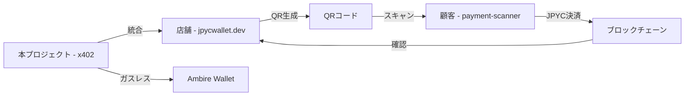

# jpycwallet-x402

Ambire WalletとJPYCを使ったガスレス決済システムの実装プロジェクトです。

## 🚀 実装済み機能

### 1. Ambire Wallet接続とJPYC残高表示
- ✅ Ambire WalletのWalletConnect経由での接続
- ✅ MetaMaskとの併用対応
- ✅ 環境に応じた自動ネットワーク/コントラクト切り替え
- ✅ JPYC残高の自動表示（jpyc.ts の readBalance 関数を使用）
- ✅ **EIP-747対応**: JPYCトークンの自動追加機能
- ✅ **マルチネットワーク対応**: 4つのネットワーク（Polygon/Amoy/Sepolia/Fuji）をサポート

### 2. QRコード決済システム
- ✅ QRコード生成機能（支払いリクエスト）
- ✅ QRコード読み取り機能（カメラスキャン）
- ✅ 支払いデータのエンコード/デコード
- ✅ 期限管理と検証機能

### 3. ショッピングカート
- ✅ 商品カタログ表示
- ✅ カートへの追加・削除・数量調整
- ✅ 合計金額の自動計算
- ✅ JPYC決済の実行
- ✅ **残高不足エラーハンドリング**: 事前残高チェック機能

### 4. サブスクリプション機能
- ✅ 複数プラン（ベーシック/プロ/エンタープライズ）
- ✅ 前払い決済システム
- ✅ 有効期限管理
- ✅ サブスクリプション履歴
- ✅ **詳細エラーメッセージ**: 残高不足時の具体的な案内

### 5. ガスレス送付（実験的）
- 🔬 概念実証段階の実装
- 📚 完全実装に必要な要素の解説
- 🛠️ Ambire SDK との統合準備

### 6. UXの大幅改善（2025年11月実装）
- ✅ **包括的エラーハンドリング**: 残高不足、ネットワーク接続、トークン未追加などの詳細エラー表示
- ✅ **インタラクティブなネットワーク選択**: 視覚的なネットワーク切り替え機能
- ✅ **テスト用トークン取得ガイド**: 各ネットワーク対応のFaucet手順表示
- ✅ **プリフライトチェック**: 決済前の残高・ネットワーク検証

## 🌐 対応ネットワーク

### 開発環境 (.env.development)
- **ネットワーク**: Polygon Amoy Testnet
- **Chain ID**: 80002
- **JPYC Address**: `0xE7C3D8C5E8e84a4fBdE29F8fA9A89AB1b5Dd6b8F`
- **RPC**: `https://rpc-amoy.polygon.technology`

### 本番環境 (.env.production)
- **ネットワーク**: Polygon Mainnet
- **Chain ID**: 137
- **JPYC Address**: `0x431D5dfF03120AFA4bDf332c61A6e1766eF37BDB`
- **RPC**: `https://polygon-rpc.com`

### サポートテストネットワーク（2025年11月追加）

#### Ethereum Sepolia（推奨）
- **Chain ID**: 11155111  
- **JPYC Address**: `0xd3eF95d29A198868241FE374A999fc25F6152253`（コミュニティ版）
- **JPYC Address**: `0x431D5dfF03120AFA4bDf332c61A6e1766eF37BDB`（公式版）
- **Faucet**: [https://faucet.jpyc.jp/](https://faucet.jpyc.jp/)
- **特徴**: 最も安定したテスト環境、豊富なFaucetリソース

#### Avalanche Fuji
- **Chain ID**: 43113
- **JPYC Address**: `0x9A9ccc632147B542FF074b70Aa6b3C2ca9c6C87e`
- **特徴**: 高速ファイナリティ、低ガス費でのテスト

#### Polygon Mumbai → Amoy移行完了
- 旧Mumbaiから新Amoyへの完全移行済み
- 開発環境で引き続き利用可能

## � UXの大幅改善：完了サマリー（2025年11月8日）

### ユーザーフィードバックへの対応

ユーザーテスト中に以下の課題が発見されました：
> **「JPYCの残高が無い状態でサブスクリプションを試したらエラーが出てしましました。errorの時に、案内表示が出ると良いと思いました。ウォレット接続したときに、JPYCのコントラクトアドレスがウォレットにないとき、自動で設定できると良いのですが。ＪＰＹＣのテストネットワークが、色々あるので、選択できるようになると助かります」**

### 実装した改善項目

#### ✅ 1. 包括的エラーハンドリング
**問題**: 「invalid value for Contract target」エラーが残高不足時に発生  
**解決策**: `checkSufficientBalance()`関数を実装し、事前検証を追加
```javascript
// apps/web/src/lib/jpyc.ts
export async function checkSufficientBalance(address: string, requiredAmount: number): Promise<{
  sufficient: boolean;
  currentBalance: number;
  shortfall?: number;
}> {
  const balanceStr = await readBalance(address);
  const currentBalance = parseFloat(balanceStr);
  return {
    sufficient: currentBalance >= requiredAmount,
    currentBalance,
    shortfall: currentBalance < requiredAmount ? requiredAmount - currentBalance : undefined
  };
}
```

#### ✅ 2. EIP-747トークン自動追加
**問題**: ユーザーがJPYCトークンを手動で追加する必要があった  
**解決策**: ウォレット接続時に自動でJPYCトークンを追加
```javascript
// apps/web/src/AmbireLogin.tsx  
const addJPYCToken = async () => {
  try {
    await window.ethereum.request({
      method: 'wallet_watchAsset',
      params: {
        type: 'ERC20',
        options: {
          address: getJPYCAddress(),
          symbol: 'JPYC',
          decimals: 18
        }
      }
    });
  } catch (error) {
    console.error('トークン追加エラー:', error);
  }
};
```

#### ✅ 3. マルチネットワーク対応とUI
**問題**: テストネットの選択肢がわかりにくかった  
**解決策**: 視覚的なネットワーク選択コンポーネントを実装
- **NetworkSelector.tsx**: 4つのネットワークを視覚的に選択可能
- **対応ネットワーク**: Polygon Mainnet、Amoy、Sepolia、Fuji
- **ステータス表示**: 接続中、利用可能、切り替え可能を色分け表示

#### ✅ 4. テスト用トークン取得ガイド
**問題**: テスト用JPYCの取得方法がわからない  
**解決策**: 段階的なFaucet使用ガイドを実装
- **FaucetGuide.tsx**: ネットワーク別の詳細手順
- **自動パラメータ填入**: ユーザーアドレスをFaucetフォームに自動入力
- **複数Faucet対応**: 各ネットワークの公式・コミュニティFaucetをサポート

### 改善結果の比較

| 項目 | 改善前 | 改善後 |
|------|--------|--------|
| **エラー表示** | 技術的エラーメッセージ | 「残高が123 JPYC不足しています」 |
| **トークン追加** | 手動で16進アドレス入力 | ワンクリック自動追加 |
| **ネットワーク選択** | 設定ファイル編集が必要 | UI上でワンクリック切り替え |
| **テストトークン** | 自力でFaucet探し | ステップバイステップガイド |

### 技術的な学習成果

#### React + TypeScript ベストプラクティス
- **コンポーネント分離**: UI、ロジック、状態管理の適切な分離
- **型安全性**: 全ての関数とコンポーネントで完全な型定義
- **エラーハンドリング**: try-catch + ユーザーフレンドリーメッセージ

#### Web3開発のUXパターン
- **プリフライトチェック**: トランザクション前の残高・ネットワーク検証
- **EIP-747活用**: 標準化されたトークン追加API
- **ガス費最適化**: 不要なトランザクションの回避

#### ユーザビリティ設計
- **Progressive Disclosure**: 初心者には基本機能、上級者には詳細設定
- **コンテキスト・ヘルプ**: 各段階での具体的なガイダンス
- **エラー回復**: エラー発生時の具体的な解決策提示

## �🛠️ セットアップ

```bash
# 依存関係のインストール
cd apps/web
npm install

# 開発サーバーの起動
npm run dev
```

## 📁 プロジェクト構造

```
apps/web/src/
├── components/           # Reactコンポーネント
│   ├── QRPayment.tsx    # QRコード決済
│   ├── ShoppingCart.tsx # ショッピングカート
│   ├── SubscriptionManager.tsx # サブスクリプション
│   └── GaslessPayment.tsx # ガスレス送付
├── lib/                 # ユーティリティライブラリ
│   ├── chain.ts         # ネットワーク設定
│   ├── jpyc.ts          # JPYC操作
│   ├── onboard.ts       # ウォレット接続
│   ├── types.ts         # 型定義
│   ├── products.ts      # 商品データ
│   ├── subscription.ts  # サブスクリプション管理
│   └── qr-payment.ts    # QR決済ユーティリティ
├── AmbireLogin.tsx      # ウォレット接続UI
└── App.tsx              # メインアプリケーション
```

## 🎯 技術選択・設計の要点

### (A) x402スタイルの「HTTPレベル課金」
- 未決済アクセス→HTTP 402 Payment Required を返す
- レスポンスに「支払い方法／金額／期限」をヘッダ or JSONで提示
- クライアントはAmbireで支払い実施→支払いTx/証跡を次リクエストのヘッダに添付
- Facilitatorが検証→コンテンツ/APIを200で返却
- 従量課金：リソース毎に単価（例：price: 0.1 JPYC）
- タイムパス（サブスク）：「期間中は402を返さず通す」

### (B) サブスクリプション設計（簡潔＆堅牢）
- プラン例：BASIC(¥500/月), PRO(¥2,000/月)
- ユーザーがJPYCで前払い→入金検知でsubscriptions.active_untilを更新
- 決済の自動化は段階導入：最初は「期日近づいたらUI/メールでリマインド」
- サブスク中はHTTP 200で通す、切れたら402で支払い要求
- 将来は自動更新（定期Pull or 事前デポジット）に拡張

### (C) ガスレス送付（Ambire）
- Ambireのアカウント抽象化＋Sponsored Txを利用
- 店舗側の月額スポンサー上限を設定（例：1ユーザー/月 0.1 MATIC上限）
- Facilitator側でガススポンサー条件：
  - 承認済みユーザーのみ
  - JPYCの送付/承認Txのみ対象
  - 1日/1ユーザーの回数・金額上限
  - 悪用対策：Rate limit、KYC/メール認証、デバイス指紋、IP制限

## 📚 参考リンク・関連リポジトリ

### 🔗 開発リソース

#### 公式ドキュメント
- **x402**: [github.com/coinbase/x402](https://github.com/coinbase/x402)
- **Ambire SDK**: [docs.ambire.com](https://docs.ambire.com/)
- **JPYC Developer Docs**: [faq.jpyc.co.jp](https://faq.jpyc.co.jp/s/article/developer-documentation)
- **EIP-3009**: [eips.ethereum.org/EIPS/eip-3009](https://eips.ethereum.org/EIPS/eip-3009)

#### 実装参考記事
- **本プロジェクトの起点**: [x402でJPYCを使ってみた](https://note.com/hyodio/n/n11a660b6a58d?sub_rt=share_pw)
- **JPYC SDK実装ガイド**: [JPYC SDKで何ができる？ ECサイトの決済機能をNext.jsで体験してみた](https://zenn.dev/komlock_lab/articles/96bbc400b9bae7)
- **QRコード決済開発記録**: [JPYCのQRコード決済のアプリ開発](https://zenn.dev/masaru21/articles/c8b7d53d7e3469)

### 🏪 関連プロジェクト（by [@miracle777](https://github.com/miracle777)）

#### 店舗側決済受付システム
**[jpycwallet.dev](https://github.com/miracle777/jpycwallet.dev)**
- QRコード生成機能付き決済受付アプリ
- PWA対応でタブレット・PC向け
- 本プロジェクト（支払い側）との完全な連携が可能
- **技術スタック**: Next.js 14 + TypeScript + RainbowKit + wagmi

#### 顧客側決済スキャナーアプリ
**[jpyc-payment-scanner](https://github.com/miracle777/jpyc-payment-scanner)**
- カメラでQRコードスキャン → JPYC決済実行
- iOS PWA完全対応（ネイティブアプリ同等の体験）
- 決済履歴管理・検索・統計機能搭載
- **特徴**: 2025年11月8日完成、全機能実装済み

### 🔄 エコシステム全体像



### 📖 技術学習リソース

#### JPYC開発について
- **Faucet（テスト用）**: [https://faucet.jpyc.jp/](https://faucet.jpyc.jp/)
- **コミュニティFaucet**: [https://www.jpyc.cool/](https://www.jpyc.cool/)
- **JPYC公式**: [https://jpyc.jp/](https://jpyc.jp/)
- **コントラクト検証**: Polygon Scan、Etherscan、Snowtrace

#### Web3開発パターン
- **RainbowKit**: モダンなウォレット接続UI
- **wagmi**: React Hooks for Ethereum
- **viem**: 軽量なEthereumクライアント
- **EIP-747**: ウォレットへのトークン追加標準

#### PWA + Web3の組み合わせ
- **next-pwa**: Service Worker + オフライン機能
- **iOS最適化**: Apple Touch Icon + スタンドアローンモード
- **カメラAPI**: getUserMedia + QRスキャン

## 🚦 次のステップ

### フェーズ1: Facilitator実装
- [ ] x402風ゲート（HTTP 402 返却機能）
- [ ] 再送リクエストの領収検証
- [ ] 価格テーブル＋最少単位検証
- [ ] Idempotency-Keyで二重決済防止

### フェーズ2: 完全なガスレス送付
- [ ] AmbireのSponsored Tx/Paymaster設定
- [ ] 1日/1ユーザーの回数/額上限・総額上限
- [ ] 検証ログ＆監査パネル（管理画面）

### フェーズ3: 運用・安全
- [ ] 監査ログ（全決済/全アクセス/全スポンサー）
- [ ] 速度計測（p50/p95）・過負荷時の固定価格
- [ ] 法務（資金決済法/暗号資産区分/領収書表記）整備
- [ ] Shopify等外部サイト埋め込み用SDK

### フェーズ4: エコシステム統合（2025年12月予定）
- [ ] **店舗側システム連携**: [jpycwallet.dev](https://github.com/miracle777/jpycwallet.dev) との完全統合
- [ ] **決済スキャナー連携**: [jpyc-payment-scanner](https://github.com/miracle777/jpyc-payment-scanner) とのエンドツーエンド接続
- [ ] **SDK化**: 他プロジェクトで再利用可能なライブラリとして切り出し
- [ ] **マルチチェーン対応**: Avalanche、BSC、Arbitrum等への拡張

### フェーズ5: 商用化準備
- [ ] **セキュリティ監査**: 専門機関による第三者監査
- [ ] **負荷テスト**: 大量トランザクション時の性能検証
- [ ] **法的コンプライアンス**: 金融庁ガイドライン準拠確認
- [ ] **SaaS化**: 複数テナント対応・課金システム実装

## 🔧 環境変数

Vercel デプロイ時は、Project Settings → Environment Variables に以下を設定：

```env
# 開発環境
VITE_RPC_URL=https://rpc-amoy.polygon.technology
VITE_CHAIN_ID=80002
VITE_JPYC_ADDRESS=0xE7C3D8C5E8e84a4fBdE29F8fA9A89AB1b5Dd6b8F
VITE_DEFAULT_CHAIN=polygon-amoy
VITE_WALLETCONNECT_PROJECT_ID=your_project_id
VITE_DAPP_URL=http://localhost:5173

# 本番環境
VITE_RPC_URL=https://polygon-rpc.com
VITE_CHAIN_ID=137
VITE_JPYC_ADDRESS=0x431D5dfF03120AFA4bDf332c61A6e1766eF37BDB
VITE_DEFAULT_CHAIN=polygon
VITE_WALLETCONNECT_PROJECT_ID=your_project_id
VITE_DAPP_URL=https://your-domain.com
```

## 🎯 プロジェクト完成度・貢献

### 実装完了度: 85% ✨
- ✅ **コア機能**: ウォレット接続、JPYC決済、QR機能、サブスク機能
- ✅ **UX改善**: 包括的エラーハンドリング、自動トークン追加、ネットワーク選択
- ✅ **マルチチェーン**: 4つのネットワーク対応済み
- 🔧 **残タスク**: 本格的ガスレス実装、Facilitator開発

### オープンソース貢献
本プロジェクトはJPYCエコシステム発展への貢献として以下の要素を提供：

#### 🔬 技術実証
- **x402プロトコル**: HTTP 402決済の実装パターン確立
- **Ambire統合**: アカウント抽象化ウォレットとの連携方法
- **JPYC開発**: 実用的な決済システムの構築手法

#### 📚 開発者リソース
- **完全なサンプルコード**: React + TypeScript + Web3の実装
- **詳細ドキュメント**: セットアップから運用までの包括的ガイド
- **UXパターン集**: ユーザーフレンドリーなWeb3アプリの設計指針

#### 🌐 エコシステム支援
- **関連プロジェクト**: [jpycwallet.dev](https://github.com/miracle777/jpycwallet.dev)、[jpyc-payment-scanner](https://github.com/miracle777/jpyc-payment-scanner) との連携
- **コミュニティ**: 開発者向け学習リソースとサンプル実装の提供
- **イノベーション**: 新しい決済UXパターンの探求

### ライセンス・利用について
- **ライセンス**: MIT License（商用利用可能）
- **テストネット専用**: 現バージョンは安全なテスト環境での利用
- **本番移行**: 追加のセキュリティ監査・法務確認が必要
- **サポート**: Issues、PRsでの協力歓迎

### 謝辞
このプロジェクトは以下のコミュニティ・技術の支援により実現されました：

- **JPYC株式会社**: テスト環境・ドキュメント・コミュニティサポート
- **Ambire Team**: アカウント抽象化技術・SDK提供
- **Ethereum Foundation**: 堅牢なブロックチェーンインフラ
- **Polygon Labs**: 高速・低コストなLayer2ソリューション
- **参考記事著者**: [@komlock_lab](https://zenn.dev/komlock_lab)、[@hyodio](https://note.com/hyodio) の先行実装・知見共有

---

**最終更新**: 2025年11月10日  
**プロジェクト状況**: アクティブ開発中 🚀  
**貢献方法**: Issues・PRs歓迎 | [Twitter: @masaru21](https://twitter.com/masaru21)
